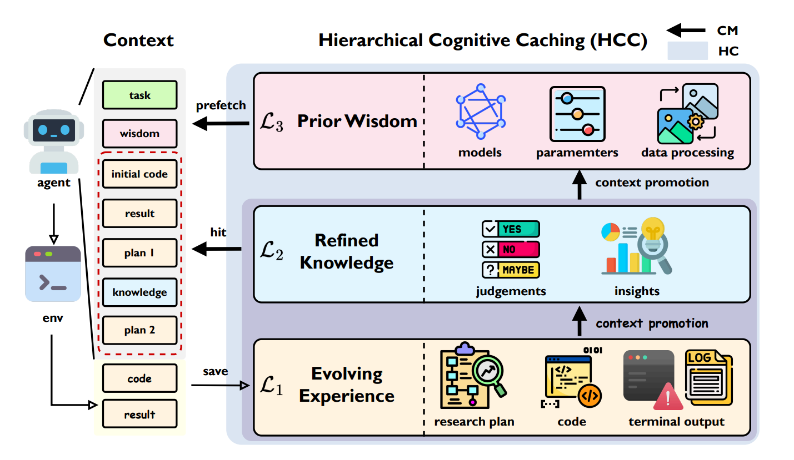
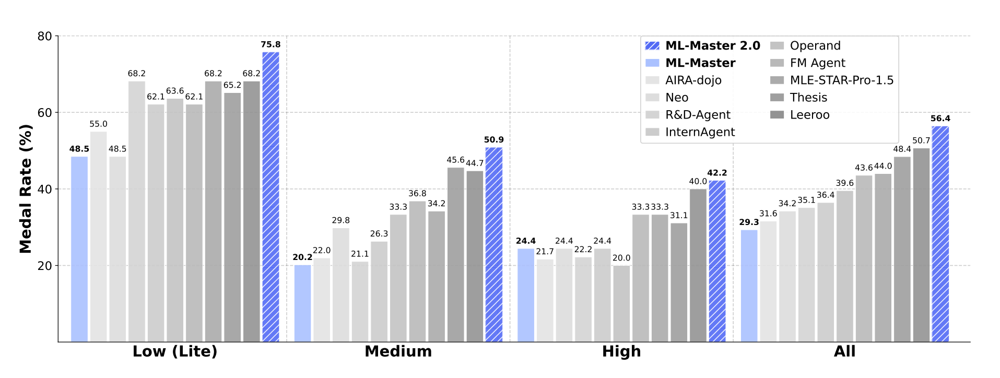
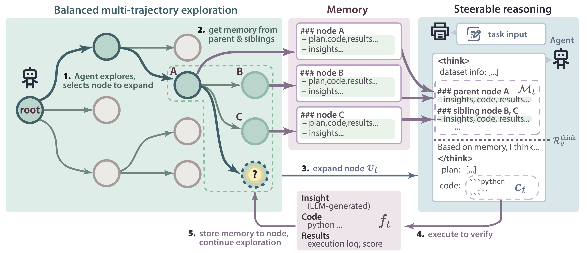
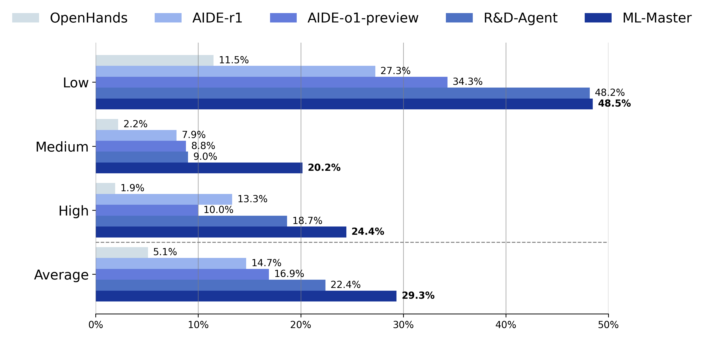

<div align="center">


</div>

> **Reproducing the adversarial-EDA experiment in this repository:** see
> [`EDA_EXPERIMENT.md`](EDA_EXPERIMENT.md) for the control/treatment protocol.
> The remainder of this file is the ML-Master setup and usage documentation.

## 📰 What's New
- [2026/01/16] Release the preprint version of ML-Master 2.0! See the [ArXiv](https://arxiv.org/abs/2601.10402).
- [2025/12/16] 🎉 **ML-Master 2.0 reaches new heights!**  Achieving #1 on [MLE-Bench](https://github.com/openai/mle-bench) Leaderboard with 56.44% overall performance (92.7% improvement over 1.0). Thanks to [EigenAI](https://www.eigenai.com/) for their high-performance AI infrastructure support.
- [2025/10/30] We upload a new branch `feature-dev` with improved readability and maintainability. If you need to continue developing on ML-Master or apply ML-Master to downstream tasks, please switch the branch to `feature-dev`. 
- [2025/10/29] We now provide a Docker image for environment setup! Check it out [here](https://hub.docker.com/r/sjtuagents/ml-master).
- [2025/10/27] Add support for gpt-5.
- [2025/08/08] Initial code release is now available on GitHub!
- [2025/06/19] Release the preprint version! See the [ArXiv](https://arxiv.org/abs/2506.16499).
- [2025/06/17] Release the initial version! See the initial manuscript [here](./assets/ML-Master_github.pdf).

# ML-Master 2.0: Cognitive Accumulation for Ultra-Long-Horizon Agentic Science in Machine Learning Engineering
[](https://sjtu-sai-agents.github.io/ML-Master)
[](https://arxiv.org/abs/2601.10402)
[](https://mp.weixin.qq.com/s/dv1MD5S2vr3MB-skV4Thrw)


## 🚀 Overview

**ML-Master 2.0** is a pioneering agentic science framework that tackles the challenge of ultra-long-horizon autonomy through cognitive accumulation, facilitated by a Hierarchical Cognitive Caching (HCC) architecture that dynamically distills transient execution traces into stable long-term knowledge, ensuring that tactical execution and strategic planning remain decoupled yet co-evolve throughout complex, long-horizon scientific explorations. 



## 📊 Performance Highlights



**ML-Master 2.0** achieves **#1 on [MLE-Bench](https://github.com/openai/mle-bench) Leaderboard** with massive performance gains:

| Metric (%)                  | ML-Master 1.0 | ML-Master 2.0 | Relative Improvement |
|----------------------------|---------------|---------------|---------------------|
| 🥇 Overall (All)           | 29.33         | **56.44**     | **+92.7% ↑**       |
| 🟢 Low Complexity          | 48.48         | **75.76**     | **+56.2% ↑**       |
| 🟡 Medium Complexity       | 20.18         | **50.88**     | **+152.2% ↑**      |
| 🔴 High Complexity         | 24.44         | **42.22**     | **+72.8% ↑**       |

## 📆 Coming Soon

- [x] Grading report release
- [x] Paper release of ML-Master 2.0
- [ ] Initial code release of ML-Master 2.0

## 🙏 Acknowledgements
<table align="center">
  <tr>
    <td align="center">
      <a href="https://sai.sjtu.edu.cn/">
        
      </a>
      <br>
      <a href="https://sai.sjtu.edu.cn/">SJTU SAI</a>
    </td>
    <td align="center">
      <a href="https://www.eigenai.com/" style="text-decoration: none;">
        
        
      </a>
      <br>
      <a href="https://www.eigenai.com/" style="text-decoration: none;">EigenAI</a>
    </td>
  </tr>
</table>

## ✍️ Citation

If you find our work helpful, please use the following citations.

```bibtex
@misc{zhu2026ultralonghorizonagenticsciencecognitive,
      title={Toward Ultra-Long-Horizon Agentic Science: Cognitive Accumulation for Machine Learning Engineering}, 
      author={Xinyu Zhu and Yuzhu Cai and Zexi Liu and Bingyang Zheng and Cheng Wang and Rui Ye and Jiaao Chen and Hanrui Wang and Wei-Chen Wang and Yuzhi Zhang and Linfeng Zhang and Weinan E and Di Jin and Siheng Chen},
      year={2026},
      eprint={2601.10402},
      archivePrefix={arXiv},
      primaryClass={cs.AI},
      url={https://arxiv.org/abs/2601.10402}, 
}
```

```bibtex
@misc{liu2025mlmasteraiforaiintegrationexploration,
      title={ML-Master: Towards AI-for-AI via Integration of Exploration and Reasoning}, 
      author={Zexi Liu and Yuzhu Cai and Xinyu Zhu and Yujie Zheng and Runkun Chen and Ying Wen and Yanfeng Wang and Weinan E and Siheng Chen},
      year={2025},
      eprint={2506.16499},
      archivePrefix={arXiv},
      primaryClass={cs.AI},
      url={https://arxiv.org/abs/2506.16499}, 
}
```

---

# ML-Master: Towards AI-for-AI via Intergration of Exploration and Reasoning

[](https://sjtu-sai-agents.github.io/ML-Master/1.0.html)
[](https://arxiv.org/abs/2506.16499)
[](https://mp.weixin.qq.com/s/8Dn7Hvpmp59-0xDD28nQkw)
[](https://hub.docker.com/r/sjtuagents/ml-master)

> **Status**: ⌛ Initial code release is now available!

## 🚀 Overview

**ML-Master** is a novel AI4AI (AI-for-AI) agent that integrates exploration and reasoning into a coherent iterative methodology, facilitated by an adaptive memory mechanism that selectively captures and summarizes relevant insights and outcomes, ensuring each component mutually reinforces the other without compromising either. 



## 📊 Performance Highlights

ML-Master outperforms prior baselines on the **[MLE-Bench](https://github.com/openai/mle-bench)**:

| Metric                      | Result                |
|----------------------------|-----------------------|
| 🥇 Average Medal Rate       | **29.3%**             |
| 🧠 Medium Task Medal Rate   | **20.2%**, more than doubling the previous SOTA            | 
| 🕒 Runtime Efficiency        | **12 hours**, 50% budget |



## 📆 Coming Soon

- [x] Grading report release
- [x] Paper release of ML-Master
- [x] Initial code release of ML-Master (expected early August)
- [x] Code refactoring for improved readability and maintainability

## 🚀 Quick Start

### 🛠️ Environment Setup

#### Pull and Start Docker Container
Please execute the following commands to pull the latest image and start an interactive container:

```bash
# Pull the latest image
docker pull sjtuagents/ml-master:latest

# Start the container
docker run --rm --gpus all --ipc=host --shm-size=64g \
  --runtime=nvidia --ulimit memlock=-1 --ulimit stack=67108864 \
  -it sjtuagents/ml-master:latest /bin/bash

# Clone the repository
git clone https://github.com/sjtu-sai-agents/ML-Master.git
cd ML-Master
conda activate ml-master
```

#### Install ml-master
To get started, make sure to first install the environment of **[MLE-Bench](https://github.com/openai/mle-bench)**. After that, install additional packages based on `requirements.txt`.

```bash
git clone https://github.com/sjtu-sai-agents/ML-Master.git
cd ML-Master
conda create -n ml-master python=3.12
conda activate ml-master

# 🔧 Install MLE-Bench environment here
# (Follow the instructions in its README)

pip install -r requirements.txt
```

---

### 📦 Download MLE-Bench Data

The full MLE-Bench dataset is over **2TB**. We recommend downloading and preparing the dataset using the scripts and instructions provided by **[MLE-Bench](https://github.com/openai/mle-bench)**.

Once prepared, the expected dataset structure looks like this:

```
/path/to/mle-bench/plant-pathology-2020-fgvc7/
└── prepared
    ├── private
    │   └── test.csv
    └── public
        ├── description.md
        ├── images/
        ├── sample_submission.csv
        ├── test.csv
        └── train.csv
```

> 🪄 ML-Master uses symbolic links to access the dataset. You can download the data to your preferred location and ML-Master will link it accordingly.

---

### 🧠 Configure DeepSeek and GPT

ML-Master requires LLMs to return custom `<think></think>` tags in the response. Ensure your **DeepSeek** API supports this and follows the `OpenAI` client interface below:

```python
self.client = OpenAI(
    api_key=self.api_key,
    base_url=self.base_url
)
response = self.client.completions.create(**params)
```
If your API does not support this interface or you are using a closed source model(e.g. gpt-5) as coding model, please add `agent.steerable_reasoning=false` to `run.sh`. This may result in some performance loss.

Set your `base_url` and `api_key` in the `run.sh` script.
**GPT-4o** is used *only* for evaluation and feedback, consistent with **[MLE-Bench](https://github.com/openai/mle-bench)**.

```bash
# Basic configuration
AGENT_DIR=./
EXP_ID=plant-pathology-2020-fgvc7   # Competition name
dataset_dir=/path/to/mle-bench      # Path to prepared dataset
MEMORY_INDEX=0                      # GPU device ID

# DeepSeek config
code_model=deepseek-r1
code_temp=0.5
code_base_url="your_base_url"
code_api_key="your_api_key"

# GPT config (used for feedback & metrics)
feedback_model=gpt-4o-2024-08-06
feedback_temp=0.5
feedback_base_url="your_base_url"
feedback_api_key="your_api_key"

# CPU allocation
start_cpu=0
CPUS_PER_TASK=36
end_cpu=$((start_cpu + CPUS_PER_TASK - 1))

# Time limit (in seconds)
TIME_LIMIT_SECS=43200
```

---

### ▶️ Start Running
Before running ML-Master, you need to launch a server which tells agent whether the submission is valid or not, allowed and used by MLE-Bench.
```bash
bash launch_server.sh
```

After that, simply run the following command:

```bash
bash run.sh
```

📝 Logs and solutions will be saved in:

* `./logs` (for logs)
* `./workspaces` (for generated solutions)

---
### 🧪 Running in this repo (batch runner + environment overrides)

In this repository the launch scripts are parameterized so they run without editing hardcoded paths. Both `run.sh` (single run) and `run_batch_parallel.sh` (parallel batch) honor these environment variables:

| Variable | Default | Purpose |
|---|---|---|
| `DATASET_DIR` | `$HOME/.cache/mle-bench/data` | Prepared MLE-bench data |
| `TIME_LIMIT_SECS` | `7200` (2 h) | Wall-clock budget per run — e.g. `300` for a smoke test, `43200` for 12 h |
| `ML_MASTER_DIR` | this agent directory | ML-Master checkout (used by the batch runner) |
| `MLEBENCH_DIR` | `<repo-root>/mle-bench` | mle-bench checkout, used for `mlebench prepare` (batch runner) |
| `CLEAN_WORKSPACES` | `0` | Set to `1` to wipe previous `workspaces/run` + `logs/run` before a batch |

```bash
# Single competition (defaults shown):
export OPENAI_API_KEY=sk-...
bash run.sh spaceship-titanic 42

# Parallel batch over a split file, 3 seeds, 12 workers:
DATASET_DIR=/data/mle-bench \
bash run_batch_parallel.sh "$MLEBENCH_DIR/experiments/splits/dev.txt" 3 12
```

> **Note:** `run_batch_parallel.sh` no longer deletes prior run output by default. Pass `CLEAN_WORKSPACES=1` explicitly if you want a clean slate.

---
### 📊 Evaluation

For evaluation details, please refer to the official **[MLE-Bench evaluation guide](https://github.com/openai/mle-bench)**.


## 🙏 Acknowledgements

We would like to express our sincere thanks to the following open-source projects that made this work possible:

* 💡 **[MLE-Bench](https://github.com/openai/mle-bench)** — for providing a comprehensive and professional AutoML benchmarking platform.
* 🌲 **[AIDE](https://github.com/WecoAI/aideml)** — for offering a powerful tree-search-based AutoML code framework that inspired parts of our implementation.


## 💬 Contact Us

We welcome discussions, questions, and feedback! Join our WeChat group:

<div align="center">


</div>

## ✍️ Citation

If you find our work helpful, please use the following citations.

```bibtex
@misc{liu2025mlmasteraiforaiintegrationexploration,
      title={ML-Master: Towards AI-for-AI via Integration of Exploration and Reasoning}, 
      author={Zexi Liu and Yuzhu Cai and Xinyu Zhu and Yujie Zheng and Runkun Chen and Ying Wen and Yanfeng Wang and Weinan E and Siheng Chen},
      year={2025},
      eprint={2506.16499},
      archivePrefix={arXiv},
      primaryClass={cs.AI},
      url={https://arxiv.org/abs/2506.16499}, 
}
```
